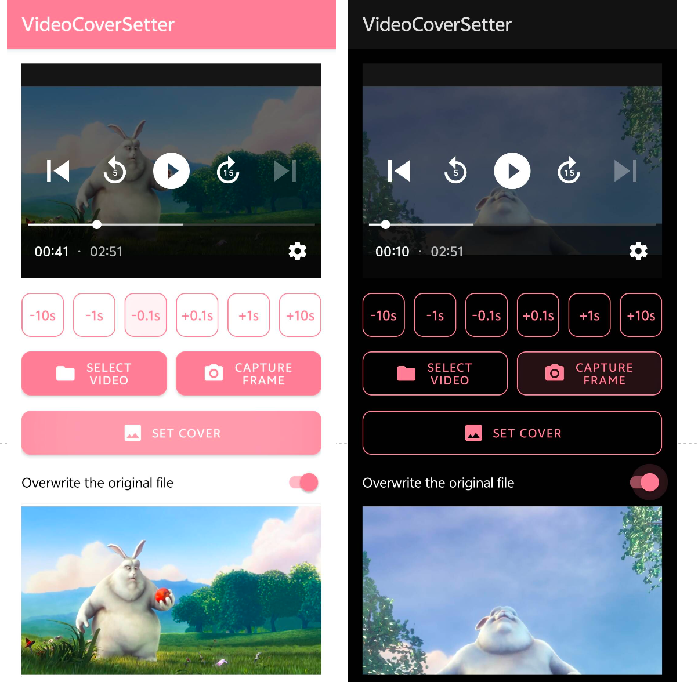

# Video Cover Setter

Video Cover Setter is an Android application that allows users to set a custom thumbnail frame as the cover image of an MP4 video file. 

## Demo

## Demo Usage

1. Open a video file.
2. Choose a frame from the video preview to set as the video cover.
3. Click the button to save the video with the selected frame as the cover image.
4. Enjoy your personalized video with a custom cover image!

## Features

- **Video Frame Selection**: Select a specific frame from a video and set it as the video cover.
- **File Access Permissions**: Requests and manages Android's all-files-access permission for working with external video files.
- **FFmpeg Integration**: Uses FFmpeg for adding the selected frame as a video cover efficiently.
- **Video Playback and Preview**: Preview up to the first 5 seconds of the video before choosing the cover frame.
- **Automatic Cleanup**: Deletes temporary files after processing is complete.

## Prerequisites

- Android Studio
- Android SDK 34 or above

## License

This project is licensed under the MIT License. See [LICENSE](LICENSE) for more details.

------

# 视频封面设置器

视频封面设置器是一款安卓应用，允许用户将自定义的缩略图帧设置为MP4视频文件的封面图像。

## 演示

## 使用方法

1. 打开一个视频文件。
2. 从视频预览中选择一个帧来设置为视频封面。
3. 点击按钮保存视频，将所选帧作为封面图像。
4. 享受您的个性化封面视频！

## 功能特点

- **视频帧选择**：从视频中选择特定帧并设置为视频封面。
- **文件访问权限**：请求和管理Android的所有文件访问权限，以便操作外部视频文件。
- **FFmpeg集成**：利用FFmpeg高效地将所选帧设置为视频封面。
- **视频播放与预览**：选择封面帧前可预览视频的前5秒。
- **自动清理**：处理完成后自动删除临时文件。

## 前置条件

- Android Studio
- Android SDK 34或以上版本

## 许可证

此项目使用MIT许可证。详情请参见[许可证](LICENSE)。